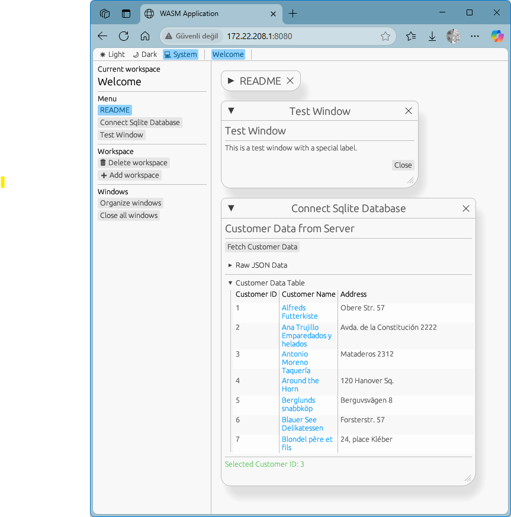

## Project Description
This project creates a cross-platform (native and WASM/web) desktop application using the Rust libraries `egui` and `eframe`. The application retrieves customer data from an SQLite database (`Northwind.db`) and displays it in a user interface.

#### Core Features:

- **Database Access:**
On the native side, data is fetched using `reqwest` (synchronous), and on the WASM side, the browser's Fetch API (asynchronous) is used to retrieve customer data in JSON format from the API endpoint at `http://localhost:3000/customers`.  
This API endpoint is served either via `server/index.ts` using Bun and `bun:sqlite`, or via `server/main.ts` using Deno and `jsr:@db/sqlite`. Both servers access and query the `db/Northwind.db` SQLite file.

- **User Interface (egui):**
In the `sqlitedata.rs` file, the fetched customer data is displayed both in raw JSON format and as a structured table using `egui_extras::TableBuilder`.  
When the "Customer Name" field is clicked, the corresponding customer's ID is shown below the table with a colored label.  
The data fetch operation is triggered automatically when the window is first opened and can also be triggered manually by clicking the "Fetch Customer Data" button.  
A simple "About" window is included in the `info.rs` file.

- **Platform Support:**
The project can be compiled and run as a native desktop application (via `src/main.rs`) or as a WebAssembly (WASM) application in a web browser (using `run_httpserver_with_*.bat` files).  
Conditional compilation (`#[cfg(...)]`) is used to provide different HTTP client implementations for native and WASM targets.

**In summary:** This project demonstrates a simple CRUD-like application (Create, Read, Update, Delete – only Read is implemented here) using `egui` in Rust. It reads data from a database through an API and displays it in a user-friendly tabular format. The application works on both desktop and web platforms.

## Running the Server
With **Bun** installed, run the following command inside the `server` directory. The `index.ts` script is a minimal API server that serves customer data from the Northwind database as JSON via the `/customers` route:
```bash
bun run index.ts
```

## Compiling as Native or WASM

### Native compilation

```bash
cargo clean
cargo update
cargo build
cargo run
```

### Steps to compile as WASM and run in the browser

WASM target: To enable Rust to compile to WebAssembly, install the `wasm32-unknown-unknown` target:

```bash
rustup target add wasm32-unknown-unknown
```

wasm-pack: Install the `wasm-pack` tool to package your Rust code into WebAssembly and make it compatible with JavaScript:

```bash
cargo install wasm-pack
```

Run the following command in your project's root directory:

```bash
wasm-pack build --target web --out-name emartident_rust_wasm --out-dir ./dist/
```

This command does the following:

*`--target web`*: Produces output suitable for web browsers.
*`--out-name wasm`*: Sets the name for the generated `.wasm` and `.js` files (e.g., `wasm.js`, `wasm_bg.wasm`).
*`--out-dir ./dist/`*: Places the output files in a `dist` folder within your project root.

You will need an HTML file to load the compiled WASM module. Create a file named *index.html* in your project’s root directory with the following content:

```html
<!DOCTYPE html>
<html lang="en">
<head>
    <meta charset="utf-8">
    <meta name="viewport" content="width=device-width, initial-scale=1.0">
    <title>WASM Application</title>
    <style>
        /* Basic styles to make the canvas fill the entire area and prevent scrollbars */
        html, body {
            height: 100%;
            margin: 0;
            overflow: hidden;
            background-color: #30303000; /* Dark background during loading */
        }
        canvas {
            display: block; /* Remove inline block spacing */
            width: 100%;
            height: 100%;
        }
    </style>
</head>
<body>
    <!-- The WASM code will resize this canvas and render the app here -->
    <canvas id="the_canvas_id"></canvas>

    <!-- JavaScript file generated by wasm-pack -->
    <script type="module">
        // Adjust the path according to your wasm-pack output
        import init, { start } from './dist/emartident_rust_wasm.js';

        async function run() {
            // First, load the Wasm module
            await init();

            // Call the 'start' function exported from lib.rs
            start('the_canvas_id');
        }

        run();
    </script>
</body>
</html>
```

You need to serve the generated files (*index.html* and the *dist* folder) using a web server. You can start a simple HTTP server from your project root.

If you have **Python** installed:

```bash
# To make it accessible from all network interfaces (use with caution – it may pose a security risk)
python -m http.server 8080 --bind 0.0.0.0
# or
python -m http.server 8080 --bind 127.0.0.1
```

If you have **Deno** installed:

```bash
deno run --allow-net --allow-read jsr:@std/http/file-server --port 8080
# or
deno run --allow-net --allow-read jsr:@std/http/file-server --addr 0.0.0.0:8080
```

If you have **Bun** installed:

```bash
bunx http-server . -a 0.0.0.0 -p 8080
```


Then open your browser and go to *[http://localhost:8080](http://localhost:8080)* (or the port used by the server) to view your application. It can also be accessed from other devices on the local network by entering the server device’s IP address.

With these steps, your project will be ready to run in the web browser.
